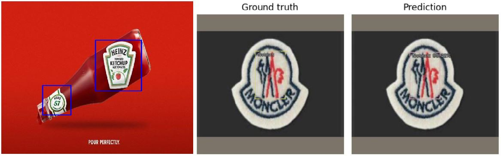

# LOGOS: A Brand Independent logo detection model

This is an implementation of LOGOS on Python 3.7.13, IceVision, and Fastai. The model generates bounding boxes for each instance of a logo in the image. It's based on retinanet and a ResNet50 backbone.

The Repository includes:
  - Jupyter notebook to train the model
  - Jupyter notebook to download and annotate the model
  - Jupyter notebook to perform inference 
  - Pretrained weights for the model
  - Annotations for the datasets
  
 
## Getting Started

| File Name                   	| Description                                                                                                                          	|                                                                                                                                                                                	|
|-----------------------------	|--------------------------------------------------------------------------------------------------------------------------------------	|--------------------------------------------------------------------------------------------------------------------------------------------------------------------------------	|
| inference.ipynb             	| It is the easiest way to start. It shows an example of how to perform inference on an image with the help of the pre trained weights. 	|              	|
| download_and_annotate.ipynb 	| It shows how to download and generate the annotations for LogoDet3K and Visually29K datasets                                         	|  	|
| Training.ipynb              	| Shows how to train the model using LogoDet-3K and Visually29K datasets                                                               	|               	|

## Datasets

| Dataset     	| Link                                             	|
|-------------	|--------------------------------------------------	|
| LogoDet-3K   	| https://github.com/Wangjing1551/LogoDet-3K-Dataset|
| Visuallydata 	| https://github.com/diviz-mit/visuallydata        	|

## Model Weights

| Weights                                  	| Link                                                                               	|
|------------------------------------------	|------------------------------------------------------------------------------------	|
| logo-retinanet-checkpoint-52k_384_50.pth 	| https://drive.google.com/file/d/1GKL15g_-g3xpUwW8tVLMKQPIv-7C77ql/view?usp=sharing 	|
| logo-retinanet-checkpoint-30000_30.pth   	| https://drive.google.com/file/d/1iLAgefVtpRZhMZwCrO1hfFpBXq5CDcrS/view?usp=sharing 	|

## Contributing

Contributions to this repository are welcome.

## Requirements

Python 3.7, torch==1.10.0, torchvision==0.11.1, icevision==0.12.0

## Installation

If you are using colab all installation instructions are given in the first cell of the notebooks

#### You may checkout the blog for a detailed explanation about the project- https://www.analyticsvidhya.com/blog/2022/08/logos-a-brand-independent-logo-detection-model/ 
